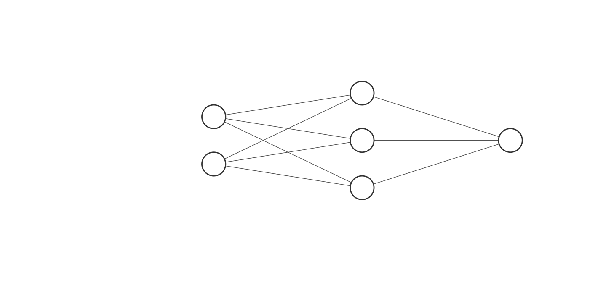
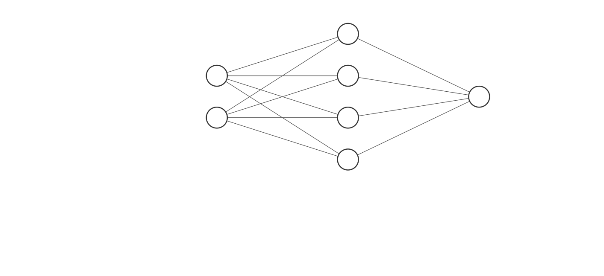
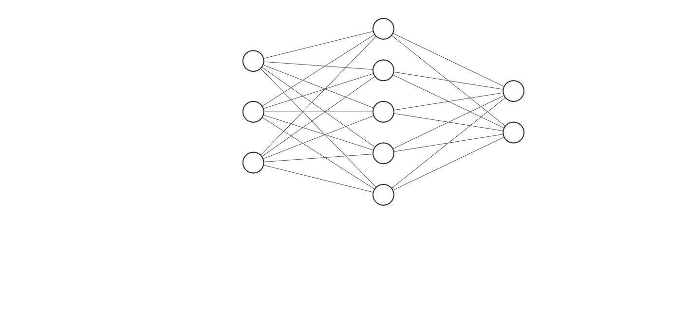

# MLP

Trabalho de multilayer perceptron da disciplina de inteligência computacional, CEFET-MG 2020.2.

Cada um dos arquivos `main_*.py` executa uma base de dados: and, or, xor e robo. 

## Execução

Para que o software execute, você precisa de instalar o numpy (única dependência):

```
pip install numpy
```

Para executar basta:

```
python3 main_or.py
python3 main_and.py
python3 main_xor.py
python3 main_robo.py
```

## Arquiteturas:

Abaixo, seguem os diagramas das redes utilizadas em cada uma das bases de dados.

### AND, OR:

<p align='center'>
    
</p>

### XOR:

<p align='center'>
    
</p>

### ROBO:

<p align='center'>
    
</p>